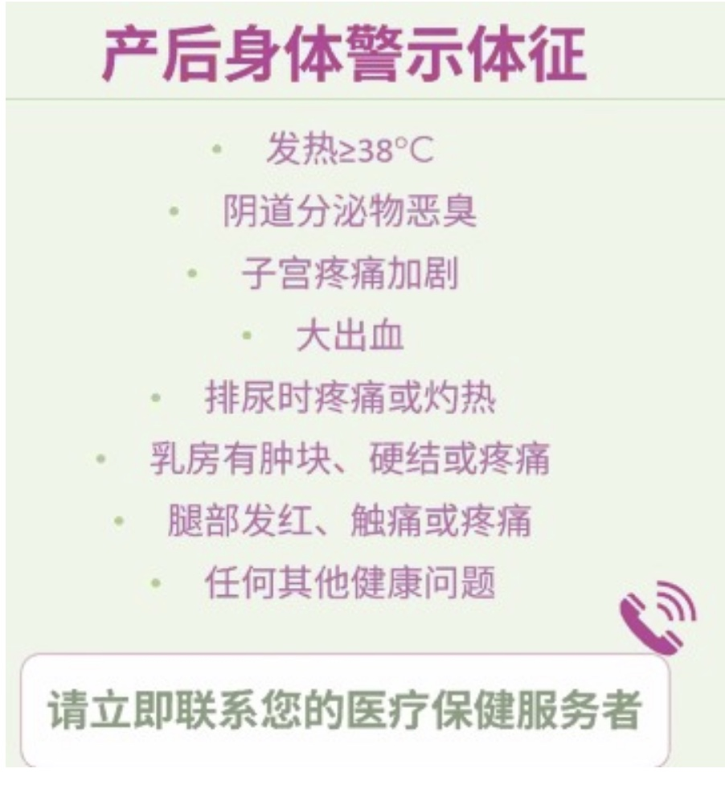
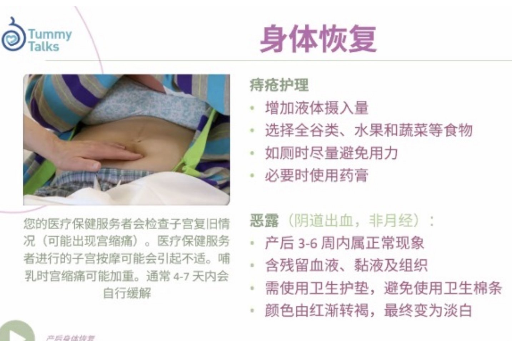
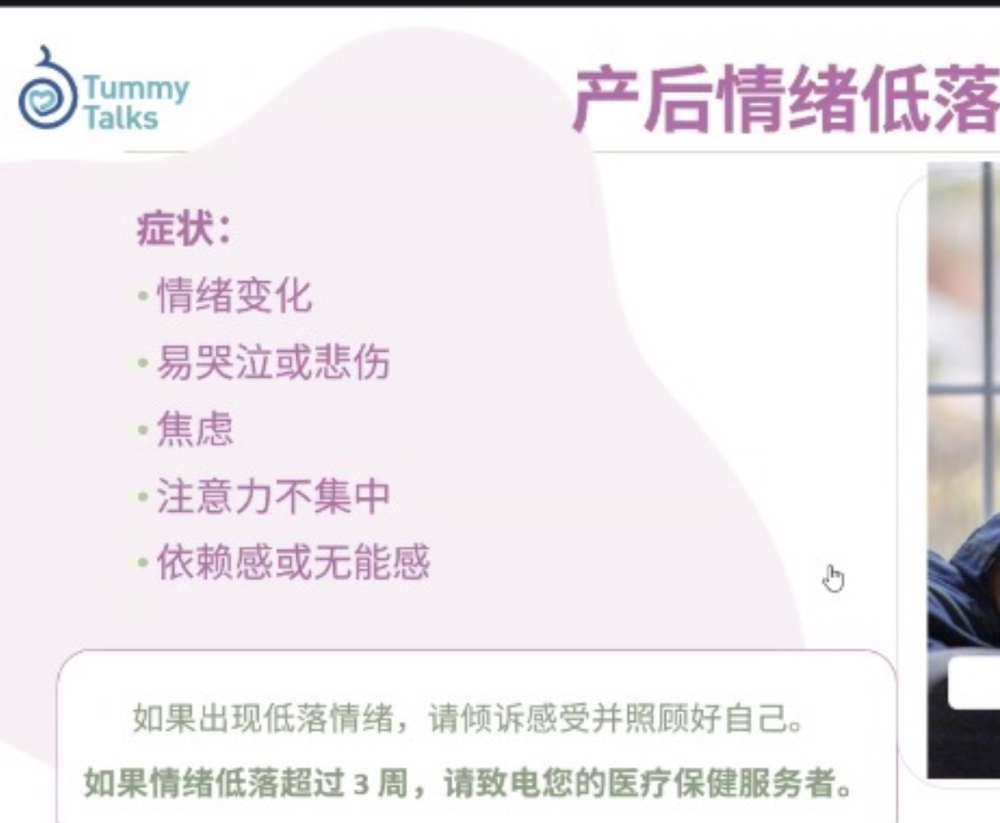
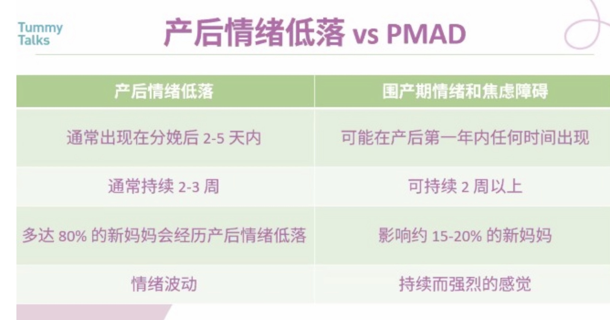

## 剖腹產後的照顧工作
- [剖腹產後的照顧工作](#剖腹產後的照顧工作)
- [首24小時](#首24小時)
  - [0-6 小時內（剛回到病房）](#0-6-小時內剛回到病房)
  - [6-12 小時內（麻醉退去，開始感痛）](#6-12-小時內麻醉退去開始感痛)
  - [12-24 小時內（可微活動、嘗試喝水）](#12-24-小時內可微活動嘗試喝水)
- [24-48小時](#24-48小時)
- [FAQ](#faq)
  - [產後警號](#產後警號)
  - [產後止痛](#產後止痛)
  - [痔瘡](#痔瘡)
  - [惡露](#惡露)
  - [疤痕貼](#疤痕貼)
  - [正确躺姿](#正确躺姿)
  - [收腹帶](#收腹帶)
  - [剖腹產後站立／走動／上廁所：分階段指引](#剖腹產後站立走動上廁所分階段指引)
  - [剖腹產後按壓肚子的情況說明](#剖腹產後按壓肚子的情況說明)
  - [你應觀察與通報的「警訊」](#你應觀察與通報的警訊)
  - [剖腹產後 48 小時內是否可以洗澡？](#剖腹產後-48-小時內是否可以洗澡)
- [擦澡（全身擦拭或沖身用）](#擦澡全身擦拭或沖身用)
- [洗臉 / 洗手](#洗臉--洗手)
- [情緒照顧](#情緒照顧)

## 首24小時

### 0-6 小時內（剛回到病房）

| 時間       | 你要做的事        | 工作內容                                                              | 達到的目的            |
| -------- | ------------ | ----------------------------------------------------------------- | ---------------- |
| 隨時       | 確保太太平安穩定     | - 留意太太臉色、出汗、臉青、嘔吐等異常 - 協助按護士要求量血壓/體溫（部分醫院需配合） - 通知護士任何不尋常情況 | 確保傷口未感染、生命跡象穩定   |
| 每15-30分鐘 | 協助監察尿袋、引流袋   | - 檢查尿袋是否暢通、尿液是否清澈 - 傷口引流液顏色是否正常                                | 確保泌尿系統正常、無感染或內出血 |
| 視乎太太狀況   | 提供精神支持       | - 握手、鼓勵、讓她安心 - 幫忙調整床、枕頭角度、用濕紙巾擦汗                               | 舒緩術後不適，降低焦慮感     |
| 依護士指示    | 協助禁食期間保持口腔濕潤 | - 幫太太以濕紗布/棉花棒擦嘴唇、口腔                                               | 預防口乾，保持清潔        |

---
### 6-12 小時內（麻醉退去，開始感痛）
- 廁所後用溫水清洗，弄乾，換新底褲
- 6-8小時後可以下床，在房間裡走動，對傷口有幫助
  
| 時間     | 你要做的事            | 工作內容                                       | 達到的目的           |
| ------ | ---------------- | ------------------------------------------ | --------------- |
| 定時     | 提醒太太按需要使用止痛泵（如有） | - 協助按護士說明如何使用止痛裝置                          | 控制疼痛，讓太太能稍作休息   |
| 每2小時   | 協助翻身             | - 輕聲提醒太太側身翻轉身體（左右交替） - 若她無法自行翻身，輕輕協助她轉動 | 預防肺積水、壓瘡，促進血液循環 |
| 每1-2小時 | 觀察傷口處是否滲血、異常     | - 輕掀被子，觀察敷料是否乾淨、無滲漏                        | 及早發現傷口異常，預防感染   |
| 如有需要   | 幫她處理情緒起伏         | - 傾聽她的擔心與不安，安慰、鼓勵 - 不要責備她不堅強            | 穩定情緒，減少產後抑鬱風險   |

---
### 12-24 小時內（可微活動、嘗試喝水）
| 時間    | 你要做的事     | 工作內容                                  | 達到的目的               |
| ----- | --------- | ------------------------------------- | ------------------- |
| 醫生許可後 | 協助太太由躺→坐  | - 扶她慢慢起身坐起（床尾升高支撐背部） - 小心避免拉扯傷口    | 促進腸胃蠕動、減少脹氣         |
| 醫生許可後 | 開始餵水/清流質  | - 小口慢慢餵水（用杯或吸管） - 觀察是否有肚脹、噁心反應     | 檢查腸胃功能是否恢復          |
| 視乎情況  | 協助擠奶/初嘗餵哺 | - 可協助她以手擠奶刺激乳腺 - 嬰兒可輕輕放胸前接觸，增加親子連結 | 促進奶水分泌、建立母嬰關係       |
| 晚上    | 幫她好好休息    | - 幫她蓋被、減少干擾、安排你照顧寶寶（如能）               | 幫助身體恢復，儲備體力迎接第2日的挑戰 |

---

## 24-48小時
| 時間段          | 工作項目              | 詳細內容                                                       | 目的                 |
| ------------ | ----------------- | ---------------------------------------------------------- | ------------------ |
| 上午（24–30 小時） | ✅ **鼓勵下床走動**      | - 在護士陪同下第一次下床 - 你應協助她穿鞋、防滑拖鞋、扶她慢慢行走 - 初步如廁           | 預防血栓、促進腸胃蠕動、幫助排氣排尿 |
| 上午           | ✅ **排氣／如廁觀察**     | - 有排氣代表腸道開始恢復 - 若便秘可提醒護士處理 - 若尿意不明顯，也需通報             | 評估腸胃功能恢復情況         |
| 上午           | ✅ **傷口觀察**        | - 幫她輕輕翻起衣服查看敷料外觀（不拆開） - 有無滲血、紅腫、異味？                     | 早期發現傷口異常（如感染）      |
| 上午           | ✅ **觀察惡露**        | - 看衛生巾是否經常濕透、有無異味 - 是否過多鮮紅或出血塊                          | 檢查子宮收縮是否正常         |
| 下午（30–36 小時） | ✅ **進食正常餐點**      | - 若已排氣，護士會讓她從流質轉回正常飲食 - 你可協助點餐、餵食、調整床背支撐 - 避免太飽、吃得太快 | 提供營養幫助傷口癒合與製奶      |
| 下午           | ✅ **協助餵奶或泵奶**     | - 若已開始分泌初乳，你可幫她抱嬰、用哺乳枕支撐 - 或協助用擠奶器                      | 促進乳腺通暢、建立母嬰連結      |
| 晚上（36–48 小時） | ✅ **舒適與情緒照顧**     | - 協助她洗臉、換乾淨衣物 - 舒緩傷口痛（調姿勢、按時吃止痛藥） - 傾聽她的壓力或情緒波動      | 降低產後抑鬱風險、提供心理支持    |
| 晚上           | ✅ **紀錄大小便、出血、體溫** | - 若醫院需紀錄輸出入量，可幫忙記錄並交給護士                                    | 方便醫護評估恢復進度         |

---
## FAQ
### 產後警號

### 產後止痛
- 頭1星期：Tylenol -> 2hrs later ->  advil  -> 2hrs later -> Tylenol -> advil 重複食用
- 在痛楚開始前就要食用

### 痔瘡
- 用ice pack用紙內包起，每2小時，放20分鐘，然後拿起，重複做

### 惡露
- 3-6 weeks屬正常
- 由紅－>啡->白
- 有1個星期完全沒血。大約月經在6週之後出現

### 疤痕貼
- 在6週之後＋見ob之後再用

### 正确躺姿
| 時間段       | 動作/姿勢                       | 應該這樣做 (正確做法)                          | 不該這樣做 (誤區/錯誤姿勢)                                    | 為什麼要這樣做 (好處)                                       | 注意事項/危險信號                                          |
| :----------- | :------------------------------ | :--------------------------------------------- | :---------------------------------------------------------- | :---------------------------------------------------------- | :--------------------------------------------------------- |
| **黃金6小時** | **平躺** | 1. 不要墊枕頭，平躺。 2. 頭要側向一邊，防止吐了嗆到。 3. 肚子上放沙袋，幫助子宮收縮。 4. 家人每30分鐘幫忙揉揉雙腿，預防血栓。 | 墊枕頭或側著躺會讓麻醉藥的反應更嚴重。                  | 促進身體恢復，預防併發症。                                  | 仔細觀察下面（陰道）出血量和尿管有沒有問題。              |
| **6小時後** | **半坐臥** | 1. 把床頭搖高30度。 2. 腰後面墊個孕婦枕。     | 腰部懸空、完全坐直或蜷縮著側躺。                            | 1. 惡露（產後分泌物）能更順暢地流出來，減少感染。 2. 肚子上的傷口不會那麼緊繃，不怕咳嗽或大笑時傷口裂開。 |                                                             |
| **24小時內** | **翻身** | 1. 雙腿彎曲並攏。 2. 雙手扶著傷口上的敷料。 3. 家人一起幫忙推肩膀和轉身（同步進行）。 | 像「鯉魚打挺」一樣猛地翻身。                                | 搭配腹帶使用，可以減輕50%的疼痛！                           | **這些情況要小心，可能是危險信號：** 1. 突然肚子劇痛，還發燒。 2. 惡露有怪味，或者量突然變多。 3. 傷口有液體滲出、紅腫發熱、疼痛。 |

---
### 收腹帶
1. **下床前先帶好**
2. **收腹帶上鬆下緊**
3. **盆骨帶靠下位置貼**
[收腹帶穿帶影片](https://www.tiktok.com/@jeanicewcg/video/7478014194143612167)

---
### 剖腹產後站立／走動／上廁所：分階段指引
[剖腹產後站立 影片](https://www.youtube.com/shorts/D5IEUniIIRg)
| 時間段      | 是否可下床？             | 走動／如廁建議                 | 尿喉拔除時間                      | 目的與注意事項              |
| -------- | ------------------ | ----------------------- | --------------------------- | -------------------- |
| 0–6 小時   | ❌ 不可自行下床           | 必須臥床休息，**完全靜臥**         | 保持插尿喉                       | 減少麻醉風險、預防出血、保持泌尿通暢   |
| 6–12 小時  | ⚠️ 一般不建議下床（可短暫坐起）  | 若情況良好，可由護理人員協助**翻身或坐起** | 仍通常保留尿喉                     | 促進腸蠕動、避免壓瘡           |
| 12–24 小時 | ✅ 可視情況**在護士協助下下床** | 醫生／護士評估後，可嘗試**走去洗手間如廁** | 尿喉**通常會在這階段拔除** 護士會建議在拔除尿喉後 6 小時內嘗試排尿，以確認膀胱功能恢復。  | 減少尿道感染風險，訓練膀胱功能，預防血栓 |

---
### 剖腹產後按壓肚子的情況說明
| 問題            | 回答                                              |
| ------------- | ----------------------------------------------- |
| **是否應該按壓肚子？** | ✅ **應該由護士或助產士按壓**，你**不應自行按壓**太太的肚子。             |
| **按壓的目的是什麼？** | 幫助子宮收縮，預防產後大出血。                                 |
| **按哪裡？**      | **子宮底部（肚臍下方約 1–2 指位置）**，不是整個腹部。                 |
| **何時按？**      | 多數在產後 1–2 小時內，每隔 15–30 分鐘按壓一次。隨後護士會定期檢查子宮硬度與位置。 |
| **誰來按？**      | 醫護人員會受過訓練，知道力度與方法。你只需配合觀察與提醒即可。                 |
| **是否痛？**      | 對太太來說會有痛感，尤其剖腹後傷口附近仍在恢復中，但這是必要的。                |

---
### 你應觀察與通報的「警訊」
| 項目 | 異常情況            | 應立即通報護士        |
| -- | --------------- | -------------- |
| 傷口 | 有大量滲血、紅腫發熱、惡臭   | 是感染或傷口裂開的可能    |
| 惡露 | 血色變鮮紅、含大血塊、滲出過多 | 可能子宮收縮不良或出血    |
| 情緒 | 太太持續哭泣、恐懼或冷淡不說話 | 是產後憂鬱早期徵象      |
| 尿液 | 排尿困難、有痛、有血絲、尿少  | 可能是尿道感染或泌尿功能異常 |
| 發燒 | 體溫 > 38°C 持續不退  | 可能感染或乳腺炎       |

---
### 剖腹產後 48 小時內是否可以洗澡？
| 問題       | 回答                     |
| -------- | ---------------------- |
| 可以全身洗澡嗎？ | ❌ **不可以**（容易感染、頭暈跌倒）   |
| 可以洗頭嗎？   | ❌ **通常不建議**（尤其住院期間）    |
| 可以擦身嗎？   | ✅ **可以擦身**，但要注意保暖與避開傷口 |

✅ **正確做法：溫水擦身**
| 項目  | 說明                                                                               |
| --- | -------------------------------------------------------------------------------- |
| 時間  | 建議在手術後 24–36 小時內，由你或護士協助擦身                                                       |
| 工具  | 溫水盆、毛巾、乾淨衣物                                                                      |
| 做法  | 先關門窗，保持室內溫暖. 用毛巾擰乾溫水擦手、臉、腋下、背、腳等. 避開傷口周圍（敷料不可沾濕） |
| 完成後 | 幫她換上乾淨月子服或病人衣，蓋好被子保暖                                                             |

一般建議產後第 4–5 天（或傷口已穩定）

---
## 擦澡（全身擦拭或沖身用）
- **薑皮**：250g（最好是老薑皮，可拍裂）
- **艾草（乾）**：100–150g
- **水量**：約 15–20 公升

**煮法：**
1. 薑皮與艾草一起放入大鍋，冷水下鍋。
2. 大火煮滾後轉中火煮 20–30 分鐘。
3. 關火後蓋上鍋蓋燜 10 分鐘。
4. 待水溫降至 38–40°C 後，用毛巾沾濕擦全身，或直接沖身。

**注意：** 剖腹產需等傷口完全癒合後才能擦到傷口部位；未癒合前可避開傷口周邊。

---

## 洗臉 / 洗手
**煮法：**
1. 薑皮與艾草放入小鍋，冷水下鍋。
2. 大火煮滾後轉小火煮 10 分鐘。
3. 關火後蓋上鍋蓋燜 5 分鐘。
4. 待水溫降至 38–40°C 後使用。

**小提醒：** 洗臉時可煮完洗澡水之後第二遍再加冷水煮，這樣比例減半，避免刺激眼睛或令皮膚過乾。

---
## 情緒照顧

