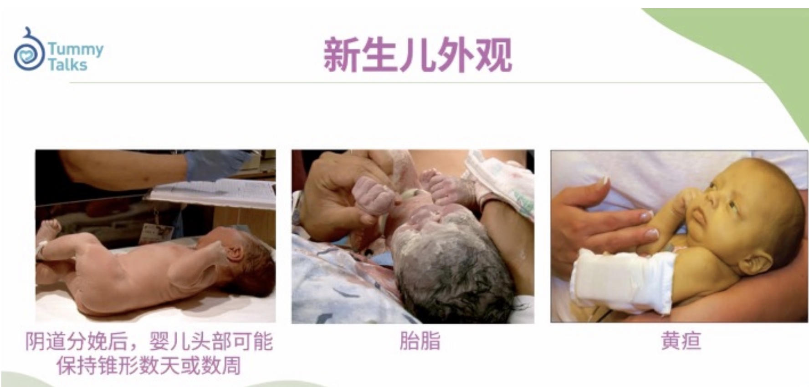
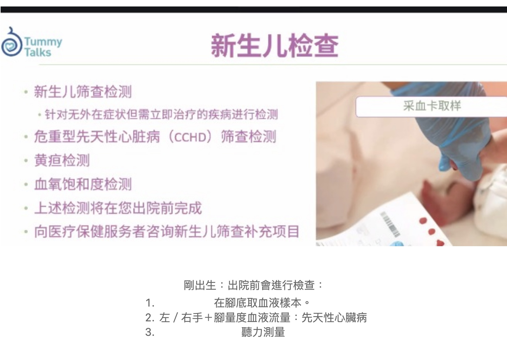
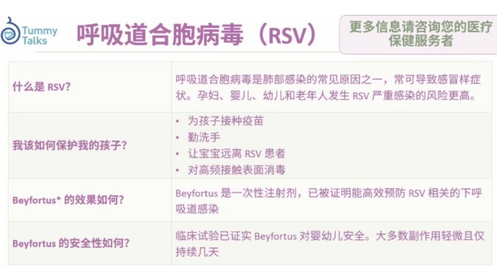
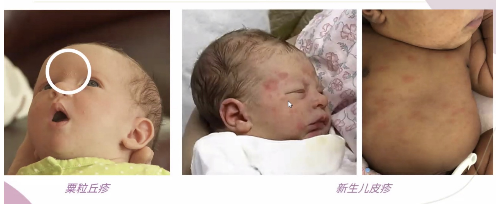

# 剖腹產後新生嬰兒照顧

- [剖腹產後新生嬰兒照顧](#剖腹產後新生嬰兒照顧)
  - [初步檢查與觀察](#初步檢查與觀察)
  - [前24 小時](#前24-小時)
  - [24～48 小時](#2448-小時)
  - [洗澡](#洗澡)
  - [新生兒可能出現的即時問題](#新生兒可能出現的即時問題)
    - [醫院的檢查及疫苗](#醫院的檢查及疫苗)

## 初步檢查與觀察
| **項目**           | **描述**                                                                                                                   |
| ------------------ | -------------------------------------------------------------------------------------------------------------------------- |
| **呼吸與心跳監測** | 在寶寶出生後，醫生會立即檢查寶寶的呼吸與心跳，確認寶寶是否健康。若寶寶的呼吸或心跳異常，會立即進行必要的處置。             |
| **阿普加分數測試** | 在出生後1分鐘和5分鐘，醫護人員會根據寶寶的心跳、呼吸、肌肉張力、反射及皮膚顏色等進行阿普加分數測試，以評估寶寶的健康狀況。 |
| **體重與身長測量** | 醫護人員會測量寶寶的體重、身長和頭圍，並記錄在寶寶的健康檔案中，這有助於後續的健康追蹤。                                   |
| **維持體溫**       | 由於新生兒對外界環境變化敏感，醫護人員會使用保溫箱或保溫毯等設施保持寶寶的體溫穩定，避免低體溫的情況發生。                 |

**初步處置**
| **項目**           | **描述**                                                                                                                           |
| ------------------ | ---------------------------------------------------------------------------------------------------------------------------------- |
| **清潔與吸痰**     | 在寶寶出生後，醫生會清潔寶寶的上呼吸道，並確保沒有羊水或分泌物阻塞呼吸道。若有必要，會使用吸引器清除寶寶氣道中的痰液或其他分泌物。 |
| **剪臍帶**         | 剖腹產後，寶寶的臍帶會由醫護人員輕輕剪斷，並用消毒夾固定，以防止感染。這是確保寶寶順利分離於母體的重要步驟。                       |
| **預防接種**       | 根據醫院的規範，寶寶可能會接受一些初步的預防接種（如乙型肝炎疫苗），並記錄在健康檔案中。                                           |
| **視力與聽力檢查** | 醫護人員會進行視力和聽力的基本檢查，確保寶寶的感官功能正常。如有異常，會進行後續檢查。                                             |

---
## 前24 小時
| 時間段      | 照顧工作            | 重點與目的            | 注意事項                    |
| -------- | --------------- | ---------------- | ----------------------- |
| 0–1 小時   | 初步檢查由醫護完成       | 評估 Apgar 分數、身高體重 | 醫院會處理，父親可拍照紀錄           |
| 1–3 小時   | 抱回產房，觀察呼吸、體溫    | 建立父母認識、皮膚接觸（如可）  | 剖腹產媽咪未能立即抱，爸爸可輕摸嬰兒手腳、說話 |
| 3–6 小時   | 第一次餵奶或餵配方奶      | 幫助建立消化與吸吮反射      | 若不哺乳，醫院會協助餵奶，**記錄時間與量**     |
| 6–12 小時  | 換尿片 1～2 次       | 評估是否有**排胎便（墨綠色）**    | 注意是否有濕尿布、觀察便便顏色         |
| 12–18 小時 | 協助入睡、餵第2餐       | 規律餵奶約每 3～4 小時一次  | 配方奶建議 30～40ml，依醫師指示為準   |
| 18–24 小時 | 第2～3 次排尿／排便、再餵奶 | 評估排泄正常與進食情況      | 注意尿量是否正常（黃尿），記錄餵奶與排便時間  |

---
## 24～48 小時
| 時間段        | 照顧項目      | 工作內容              | 預期次數／頻率       | 目的與觀察重點       | 注意事項                        |
| ---------- | --------- | ----------------- | ------------- | ------------- | --------------------------- |
| 全日（每3～4小時） | 餵奶（配方）    | 每次餵 30–50 ml 配方奶  | 約 6～8 次／日     | 滿足營養、穩定血糖     | 觀察是否有吸吮力、嗆奶或拒奶              |
| 餵奶後        | 拍嗝        | 垂直抱起，輕拍背部         | 每次餵奶後都要       | 減少吐奶、脹氣       | 拍至聽見嗝聲或約 5–10 分鐘            |
| 每 2～3 小時   | 換尿片       | 清潔＋換新尿布           | 約 6～8 次／日     | 觀察排尿量與便便變化    | 留意是否紅屁屁、皮膚過敏                |
| 任意時間       | 排便        | 通常為墨綠 → 黃褐 → 黃色糊狀 | 約 1～3 次／日（正常） | 便便顏色與次數反映腸道功能 | 若超過 48 小時未排便請告知醫護           |
| 全天（分段）     | 睡眠        | 每次 2～4 小時，小睡為主    | 全日約 16–18 小時  | 腦部與身體發育所需     | 確保安全睡姿：仰睡、不蓋口鼻              |
| 每 4 小時     | 量體溫（醫護）   | 使用耳溫槍或腋下量         | 6 次／日（醫院內）    | 監測是否低溫或發燒     | 正常 36.5–37.5°C，若低於 36°C 要報告 |
| 每次接觸       | 衛生管理      | 抱前洗手、避免親吻嘴臉       | 持續進行          | 預防感染，尤其是口水疱疹  | 來探望者請避免近距離接觸                |
| 每日 1 次     | 視覺刺激與親子互動 | 看爸爸媽媽、聽聲音         | 不限次數、短時間      | 刺激感官發育，建立安全感  | 保持燈光柔和，不強迫互動                |

---
## 洗澡
- 每星期洗2－3次全身，每天抹身
- 24小時內不要洗澡，盡量回家洗澡。
- 可以要護士demo一次。
- 如果不乾就可以不搽，如要用就低敏
  
---
## 新生兒可能出現的即時問題

### 醫院的檢查及疫苗
- 外觀
  - 頭形： 剛出生頭形會變長，幾天後會回復正常
  - 胎脂： 不要洗走胎脂，會自行吸引
  - 
- 檢查
  - 
- RSV

- 紅疹會2週自行回復

- 黃疸
  - 出院前：有測試評估風險，會告訴你什麼時候回來
  - 出院後：如果眼白＋身變黃，吃奶不好，尿量也不夠，直接看醫生

--- 

| **問題**                 | **表徵及原因**                                                                                                   | **處理**                                                                                                                                 | **風險等級** |
| ------------------------ | ---------------------------------------------------------------------------------------------------------------- | ---------------------------------------------------------------------------------------------------------------------------------------- | ------------ |
| **黃疸**                 | 皮膚或眼白發黃，主要由於肝臟功能未完全成熟，無法有效處理體內的膽紅素，尤其是出生後幾天內較為明顯。               | 醫護人員會監測寶寶的黃疸程度，輕度黃疸可通過適當的光療治療來緩解。若黃疸過重，則需住院治療。                                             | 低           |
| **吸吮困難**             | 剖腹產後，寶寶可能會因為分娩過程的不同影響，導致吸吮反射不強，難以順利吸奶。                                     | 初期可嘗試使用吸奶器輔助寶寶吸乳，或協助寶寶正確吮吸。母乳喂養時，應確保寶寶能夠有足夠的吸奶量。如果問題持續，應尋求哺乳顧問或醫生幫助。 | 低           |
| **胃食道逆流**           | 因為剖腹產過程中寶寶的姿勢較為特殊，胃部可能因重力作用不佳，導致食物容易回流至食道，表現為嘔吐或頻繁吐奶。       | 可將寶寶頭部抬高，並保持直立的姿勢進行餵食。若情況持續或加劇，應尋求醫療協助進行診斷和治療。                                             | 低           |
| **體溫不穩**             | 剖腹產寶寶在出生後可能無法及時調節體溫，體溫可能會過低或過高。原因可能包括產後初期的保溫不足或母嬰皮膚接觸較少。 | 提供暖和的環境，及時穿上合適的衣物以保持體溫穩定。可進行皮膚接觸或抱著寶寶，以促進體溫調節。如果問題持續，應尋求醫療幫助。               | 低           |
| **低血糖**               | 新生兒可能會因為分娩過程中的應激反應，或剖腹產後初期喂養不夠而引起血糖下降，表現為嗜睡、哭鬧不安或吃奶困難。     | 監測寶寶血糖情況，適時進行母乳喂養或使用葡萄糖水等補充寶寶所需的能量。如果低血糖症狀未改善，需進一步治療。                               | 中           |
| **出血過多（產道受傷）** | 剖腹產後，寶寶可能會因產道傷口或過程中的出血而產生異常的出血情況。這可能是由於分娩過程中操作所引起的。           | 監測寶寶的血液狀況，若出現異常出血，需立即告知醫護人員並及時進行止血處理。                                                               | 中           |
| **呼吸困難**             | 寶寶可能會因為剖腹產過程中較少的產道壓迫，未能有效排出肺部的液體，導致呼吸急促、鼻翼扇動或嘴唇發紺。             | 立即監測寶寶的呼吸情況，醫護人員會進行吸氧或吸痰等處置。若呼吸困難持續，則需要進一步治療或住院觀察。                                     | 中           |
| **胎便吸入症候群**       | 剖腹產寶寶在出生過程中，胎便可能會被吸入肺部，導致呼吸困難。常見表現包括呼吸急促、藍紫色皮膚或吸氣時困難。       | 醫護人員會監測寶寶的呼吸狀況，進行吸痰、氧氣治療等措施來清除肺部的異物。如果情況較為嚴重，可能需要住院並接受進一步的治療。               | 高           |
| **生理性低體重**         | 由於剖腹產的分娩方式，寶寶可能出現低體重的情況，尤其是早產或胎兒未達標準體重。                                   |
