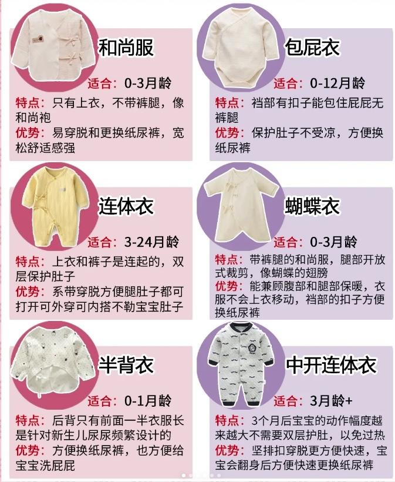

# 目錄
- [目錄](#目錄)
- [衣服種類](#衣服種類)
- [白天穿搭建议](#白天穿搭建议)
- [晚上穿搭建议](#晚上穿搭建议)
- [店铺推荐及评价](#店铺推荐及评价)
- [用品推荐](#用品推荐)

# 衣服種類
**避免套头款、分体款，不便穿脱**
| 数量 | 适用年龄 | 类型       | 说明                                         | 优势                                      |
|----|------|----------|--------------------------------|--------------------------------|
| 0件 | 0－3月 | 半背衣    | 后背只有前面一半的衣服长，是针对新生儿尿尿频繁设计的 | 方便换纸尿裤，也方便给宝宝洗屁屁      |
| 7件 | 0－3月 | 和尚服    | 只有上衣，不用裤子，外包被                  | 容易穿脱和更换纸尿裤               |
| 0件 | 0－3月 | 蝴蝶衣    | 保护肚子不受凉                           | 容易穿脱和更换纸尿裤               |
| 4件 | 0－12月 | 包屁衣    | 裆部有扣子能包住屁屁，无裤腿              | 保护肚子不受凉，方便换纸尿裤        |
| 0件 | 3－24月 | 连体衣    | 上衣和裤子是连起                        | 系带穿脱方便，腿部和臀部都可以打开  |
| 0件 | 3月＋  | 中开连体衣 | 动作幅度越来越大，不需要双层护肚，以免过热  | -                                |

---

# 白天穿搭建议
| 温度         | 推荐穿搭                        |
|------------|------------------------------|
| 26°C以上   | 短袖连体衣或短袖包屁衣         |
| 20°C左右   | 长袖连体衣 + 薄款背心         |
| 15°C左右   | 长袖包屁衣 + 夹棉连体衣       |
| 10°C左右   | 长袖包屁衣 + 夹棉连体衣 + 厚棉服 |
| 0°C左右    | 长袖包屁衣 + 夹棉连体衣 + 羽绒服 |

# 晚上穿搭建议
| 温度         | 推荐穿搭                        |
|------------|------------------------------|
| 26°C以上   | 短袖纱布睡袋                  |
| 20-25°C    | 四层纱布睡袋 + 纱布盖毯       |
| 15-20°C    | 长袖包屁衣 + 六层纱布睡袋 + 薄盖毯 |
| 10-15°C    | 长袖连体衣 + 薄棉睡袋 + 薄盖毯 |
| 10°C以下   | 长袖连体衣 + 加

# 店铺推荐及评价

| 店铺      | 性价比 | 款式 | 尺码            | 评价 |
|---------|------|----|---------------|------|
| Carter’s  | 5    | 5  | 总体偏小，小面包3个月穿6个月，现在快6个月需要穿9个月的尺码 | 小月龄宝宝的衣服款式选择多，性价比高。有些款式仅限官网购买，推荐查看。Little Planet 系列采用有机棉，稍贵但舒适，推荐。衣服容易缩水，洗后变形。 |
| Old Navy  | 5    | 2  | 适中，但衣服洗后可能会缩水，需要更换更大尺码 | 宝宝衣服质量不错，款式选择较少，但偶尔能找到可爱的款式。 |
| Gap      | 5    | 3  | 正常            | 官网款式较多
|H&M|||

# 用品推荐
| 物品         | 推荐数量 | 备注                          |
|------------|--------|---------------------------|
| 小方巾      | 4-6条  | 前三个月吐奶频繁，很实用 |
| 纱布浴巾    | 各2条  | 使用场景多，使用时间长，建议4-6层各备2条 |
| 包被/抱被   | 2条    |                        |