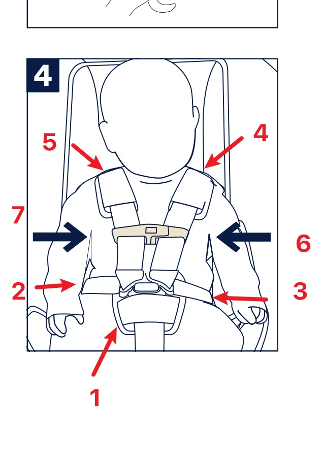

# 嬰兒環境
- [嬰兒環境](#嬰兒環境)
- [1. 睡覺](#1-睡覺)
- [2. 汽車坐椅](#2-汽車坐椅)
  - [安裝](#安裝)
  - [使用](#使用)

# 1. 睡覺
- 不要同床，但要同房
- 床上不要有任何其他東西，包括被，枕頭，公仔
- 在嬰兒範圍不要有煙味
- 睡前可用奶嘴安靜
- [影片 1](https://www.youtube.com/watch?v=rZ2NXdZ_sHo&ab_channel=PublicHealthAgencyofCanada)

# 2. 汽車坐椅
## 安裝
- [車上安裝影片](https://www.youtube.com/watch?v=LVg7Tk4yOYE&ab_channel=WordofAdviceTV)
- [說明書](https://nunababy.com/media/catalog/product/N/u/Nuna_PIPA_IM_0246D_ba8f.pdf)
- **底坐安裝 - 方法1**

- **底坐安裝 - 方法2**

## 使用
- bb 不能空厚衫褲
- 可以在穿好安全帶後蓋上被子
- BB 面 必須面向車的尾部 (後向型)

