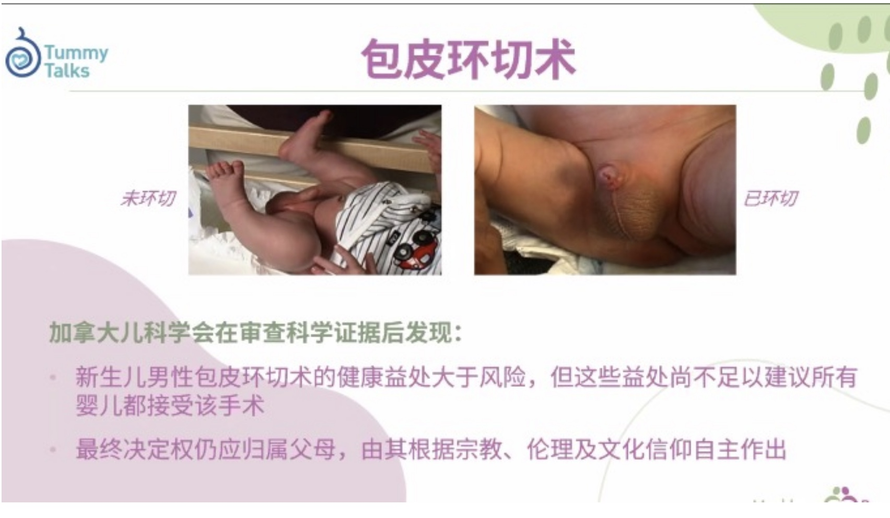

# 生病
# [各種病相關的資源](https://www.aboutkidshealth.ca/zh-Hant/health-information-in-traditional-chinese/)

# 如何知道生病
- **體溫＞38度必須看醫生**
- 如果不願起床 或 不停尖喊 就有可疑
  - 特點: 體重低於出生時 -10% (E.g. 10lb -> 9lb)
  
# 缺水
- 頭3天如果尿片有粉紅色就正常，之後就代表缺水

# 眼部分泌物 Eye discharge
- 溫水，一次毛巾，內往外抹，每次換一塊新的。
- 用手輕按摩眼角，3-5次，1-2分鐘

# 餵食時
- 吐奶: 奶的顏色不同、要去看醫生
- 胎糞: 第5天仍然是白，紅，黑色 要去看醫生

# 皮疹 Hives
- 頭1-3天出現，集中身上/臉上，有白色點，不用擔心，自行回復
- 如果出現在手或腳上，或出現濃泡，去看醫生

# 鼻腔乾澀症狀
- 原因
  - 空氣乾燥
  - 灰塵、菸草煙霧或香水等刺激物質
  - 病毒性疾病（感冒等）
- 解決方法 
  1. 濕潤寶寶的鼻腔 － 生理鹽水滴鼻劑。
      - 讓孩子仰臥，在其肩膀下方鋪墊毛巾卷或小毯子，或輕按鼻尖，幫助藥水流入鼻腔。
      - 每側滴入兩至三滴。等待30-60秒，然後再清理鼻腔。
  2. 用生理鹽水滴鼻劑清除黏液
       - 讓孩子仰臥，在其肩膀下方鋪墊毛巾卷或小毯子，或輕按鼻尖，幫助藥水流入鼻腔。
       - 每側滴入兩至三滴，等待30至60秒。
       - 讓孩子翻身俯臥，這一姿勢有助於黏液流出
       - 用面巾紙或棉簽擦拭流出的黏液。
       - 這一過程中，孩子可能會咳嗽或打噴嚏，帶出黏液和滴鼻劑。
       - 用棉簽或面巾紙沿鼻孔周圍按壓，幫助黏液流出。不要將棉簽放入孩子的鼻腔內。
  3. 使用管狀吸鼻器時，需將管子一端放入寶寶鼻孔，
       - 初次使用前，吸鼻器要用熱水浸洗，並徹底晾乾。**吸鼻器不可消毒或在沸水中浸泡**
       - 將新的過濾棉放入隔層，然後連接好吸鼻器。
       - 讓孩子仰臥，頭稍向右轉。小心地將一至兩滴生理鹽水滴入鼻孔
       - 然後讓孩子頭稍向左轉，另一側鼻孔也進行相同操作。
       - 將吸鼻器的軟端吸頭放在寶寶鼻孔處（無需過多伸入）。您從吸嘴處吸氣，輕輕吸出黏液。
       - 黏液將被收集在衛生過濾棉中，不會進入吸管另一側。
       - 對另一側鼻孔進行相同操作。輕輕抬起寶寶的身體，以使殘餘黏液流出。
       - 用浸有生理鹽水的紙巾或棉球輕輕擦拭寶寶的鼻孔。
       - 每次使用完畢後，斷開吸鼻器的連接端口，拆除過濾棉並丟棄，用熱水浸洗吸鼻器並晾乾。
  
- [相關的資源](https://www.aboutkidshealth.ca/healthaz/na/nasal-congestion-how-to-clear-your-babys-dry-stuffy-nose/?language=zh-Hant)

# 腸紋痛 

- 多數時間由傍晚 至晚上
- **特徵： 3x3x3 ＝ 每次3 小時，每週持續 3次, 連續 3星期**
- 症狀
  - 比平常喊得利害，雙手緊握，面紅，弓背
  - 高分貝哭鬧：新生兒腸絞痛時會出現劇烈、高聲、長時間的哭泣，尤其在晚上更常見。
  - 肚子脹脹的：腸道中的氣體積聚可能引起腹部脹氣和脹塞感。
  - 常把腿部弓起、不斷拳打腳踢：新生兒可能會試圖緩解不適感，將腿部拉向腹部，或是揮動拳頭或腳踢腹部來緩解不適感。
- 影響
  - 不安和睡眠困難：腸絞痛可能導致嬰兒難以入睡，並表現出焦慮和不安的行為
- 解決方法
  - [飛機抱](https://www.youtube.com/shorts/NC44IIHEwdM)
  - [包被](https://www.youtube.com/watch?v=pJCQf2Xxlrk&ab_channel=MountSinaiParentingCenter)

# 包皮
